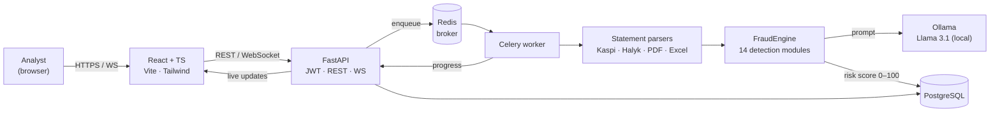

<div align="center">

# ntFAST

### Network Transaction Fraud Analysis System

**Privacy-first platform for analyzing bank statements and detecting financial fraud — powered by a local LLM, so sensitive data never leaves the server.**

[](https://www.python.org/)
[](https://fastapi.tiangolo.com/)
[](https://react.dev/)
[](https://www.typescriptlang.org/)
[](https://www.postgresql.org/)
[](https://www.docker.com/)
[-000000?logo=ollama&logoColor=white)](https://ollama.com/)

</div>

---

## Overview

**ntFAST** ingests bank statements (Kaspi, Halyk and generic Excel / PDF / CSV), normalizes the transactions, and runs them through a **14-module fraud-detection engine** that combines rule-based, statistical and LLM-driven analysis into a single explainable **risk score (0–100)**.

The whole stack runs **on-premise**: parsing, scoring and the language model (Llama 3.1 via Ollama) all execute locally. No transaction ever leaves the machine — a hard requirement for handling financial data under Kazakhstan's Personal Data Protection Law (№94-V).

> Built as a graduation project (Software Engineering) — awarded a copyright certificate, a 1st-degree diploma at an international student competition, and a conference publication.

---

## Key Features

- 📄 **Smart statement parsing** — Kaspi Bank & Halyk Bank layouts plus generic Excel / PDF / CSV, with automatic transaction normalization and de-duplication.
- 🛡️ **14-module fraud engine** — rules + statistics (Z-score, IQR, Benford's Law) + graph analysis + a local LLM, aggregated into a weighted **composite risk score** with `LOW / MEDIUM / HIGH / CRITICAL` bands.
- 🧠 **Local LLM (Llama 3.1 via Ollama)** — contextual NLP analysis of transaction descriptions without sending data to any cloud.
- ⚡ **Async processing** — heavy parsing & scoring run in Celery workers; the UI streams live progress over WebSocket.
- 🔐 **Auth & security** — JWT authentication, bcrypt password hashing, role-based access (admin / analyst), email verification, login history and active-session management.
- 🔔 **Real-time notifications** — persistent bell-icon notifications + WebSocket events (new login, parallel session, analysis finished).
- 🌐 **Trilingual UI** — Kazakh / Russian / English (i18next), with light & dark themes.
- 📊 **Dashboards & reports** — interactive charts (Recharts) and exportable PDF reports.

---

## Architecture



**Three tiers:** React client → FastAPI server → AI/analysis layer. Postgres is the source of truth; Redis backs both the Celery queue and caching; the LLM runs as a separate local service.

---

## Tech Stack

| Layer | Technologies |
|-------|--------------|
| **Backend** | Python 3.11 · FastAPI · SQLAlchemy 2 · Pydantic 2 · Alembic |
| **Async / Queue** | Celery · Redis 7 |
| **Database** | PostgreSQL 16 (SQLite fallback) |
| **AI / ML** | Ollama (Llama 3.1) · pandas · NLP · statistical models (Z-score, IQR, Benford) |
| **Parsing** | pdfplumber · openpyxl · xlrd · python-dateutil |
| **Auth** | python-jose (JWT) · passlib + bcrypt |
| **Frontend** | React 18 · TypeScript 5 · Vite 5 · Tailwind CSS 3 |
| **UI** | Framer Motion · Recharts · react-i18next · lucide-react · sonner |
| **Infra** | Docker Compose (5 services) · Railway |

---

## Fraud Detection Engine

`backend/app/services/fraud/engine.py` orchestrates independent detectors and merges their signals into one composite score:

| Module | What it catches |
|--------|-----------------|
| `velocity` | Abnormal transaction frequency / bursts |
| `structuring` | Smurfing — amounts split to stay under reporting thresholds |
| `graph_analysis` | Suspicious counterparty networks & money flows |
| `cross_reference` | Links across subjects and accounts |
| `merchant_risk` | High-risk merchant / category exposure |
| `night_transactions` | Unusual activity during night hours |
| `duplicate_detector` | Repeated / cloned transactions |
| `round_amounts` | Artificially round-number transfers |
| `profile_mismatch` | Activity inconsistent with the subject's profile |
| `behavioral` | Deviation from the subject's historical behavior |
| `nlp_analyzer` | **LLM** contextual analysis of transaction descriptions |
| `account_profiler` | Builds the behavioral baseline per subject |
| `pattern_detector` | Generic statistical anomaly patterns |
| `whitelist` | Suppresses known-good counterparties to cut false positives |

→ **Composite risk score 0–100** → `LOW · MEDIUM · HIGH · CRITICAL`, each flag fully explainable.

---

## Quick Start

### Option A — Docker (everything in one command)

```bash
git clone https://github.com/ntazhi/ntfast.git
cd ntfast
cp backend/.env.example backend/.env        # then edit secrets
docker compose up --build
```

Compose boots **5 services** with health-checks and the correct start order:
`postgres` → `redis` → `backend` + `celery_worker` → `frontend`.

- Frontend → http://localhost
- API + Swagger docs → http://localhost:8000/docs

### Option B — Manual (local dev)

> Requires Python 3.11, Node 18+, PostgreSQL 16, Redis 7, and [Ollama](https://ollama.com/) with `ollama pull llama3.1`.

```bash
# Backend
cd backend
pip install -r requirements.txt
cp .env.example .env
alembic upgrade head
uvicorn app.main:app --reload --port 8000

# Celery worker (separate terminal)
celery -A app.core.celery_app worker --loglevel=info --pool=solo

# Frontend (separate terminal)
cd frontend
npm install
npm run dev
```

---

## Project Structure

```
ntfast/
├── backend/
│   └── app/
│       ├── api/          # REST routers (auth, analyses, subjects, transactions, …)
│       ├── core/         # config, database, security, celery
│       ├── models/       # SQLAlchemy models (user, subject, transaction, …)
│       ├── schemas/      # Pydantic schemas
│       ├── services/
│       │   ├── fraud/         # the 14-module detection engine
│       │   ├── bank_analyzer/ # statement parsers (Kaspi, Halyk, …)
│       │   └── …
│       ├── tasks/        # Celery tasks
│       └── middleware/   # security headers, etc.
├── frontend/
│   └── src/              # React + TypeScript app (components, locales, pages)
├── docs/                 # technical docs + architecture diagram (.drawio)
├── test_data/            # synthetic sample statements
└── docker-compose.yml
```

---

## Testing

```bash
cd backend
pytest
```

The fraud engine and parsers are covered by an automated test suite (`backend/tests/`).

---

## Roadmap

- [ ] Public REST API for third-party integrations
- [ ] Graph database (Neo4j) for deeper network analysis
- [ ] React Native mobile client
- [ ] Federated learning across institutions

---

## License

Released under the [MIT License](LICENSE).

<div align="center">

**ntFAST** — made in Kazakhstan 🇰🇿 · backend + AI + frontend by [@ntazhi](https://github.com/ntazhi)

</div>
